# Todolist d'Ewan EL KIHAL

Ce projet a été réalisé en **React**. Pour le lancer, il vous suffit de cloner
le dépôt et d'exécuter les commandes suivantes :

```npm install```

```npm start```

Alternativement, vous pouvez accéder à la version web ici :
[https://wan-todo.vercel.app/](https://wan-todo.vercel.app/) 

Tout est entièrement stocké en local, aucune donnée n'est envoyée au
serveur. Le site n'est pas entièrement responsive, et ne saurait être
utilisé sur un téléphone. Je recommande l'utilisation de **Chrome** pour
visualiser le site. Des problèmes d'affichage peuvent survenir sur Firefox
de mon expérience.

## Fonctionnalités implémentées

- Ajout, modification, suppression de tâches;
- Ajout, modification, suppression de catégories;
- Choisir entre charger un backup ou repartir à zéro;
- Filtres combinables;
- Sauvegarde automatique des données;
- Export et import des données;
- Réinitialisation des données depuis des données par défaut;
- Vider les données;
- Affichage sélectif "toutes les tâches", "tâches non terminées", 
"tâches terminées";
- Affichage spécifique lorsque la date d'échéance est à moins d'une 
semaine;
- Affichage spécifique lorsque la date d'échéance est dépassée de moins
d'une semaine;
- Affichage spécifique lorsque la date d'échéance est dépassée de plus 
d'une semaine;
- Bouton "gérer les catégories";
- Bouton "modifier les catégories"...

## Architecture du code

Le code est divisé en plusieurs parties : 
- **src/components** : contient les composants React;
- **src/components/modals** : contient les fenêtres modales;
- **src/fonts** : contient les polices de caractères;
- **src/services** : contient les services de gestion des données;
- **src/utils** : contient les utilitaires.

Les fichiers `App.css` et `App.js` sont les fichiers principaux de l'application.

## Captures d'écran

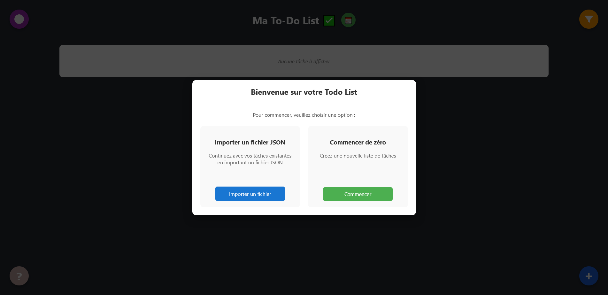

Point d'entrée de l'application

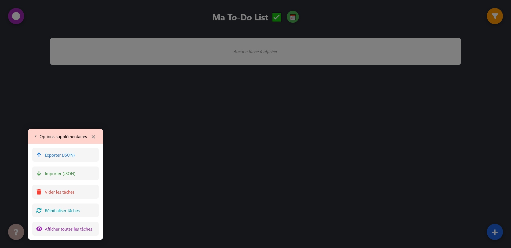

Menu en bas à gauche

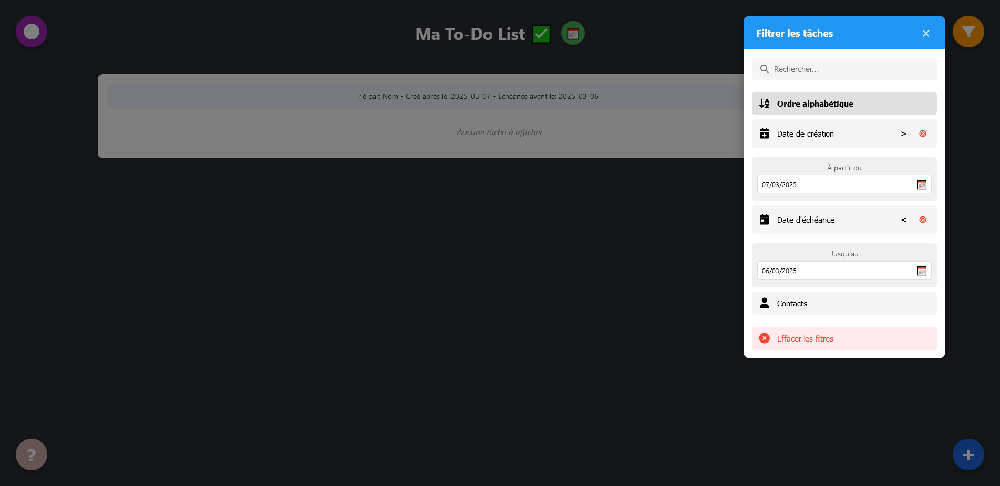

Utilisation de filtres en combinaison

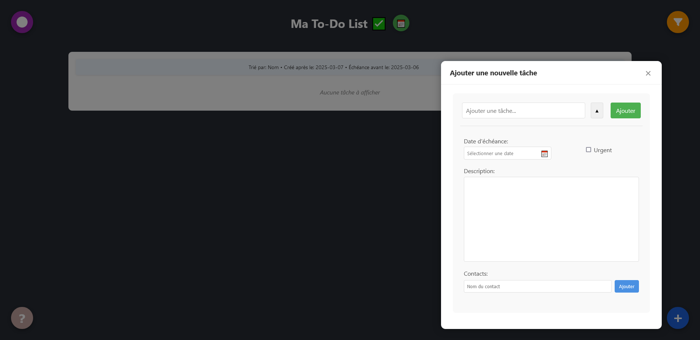

Ajout d'une tâche

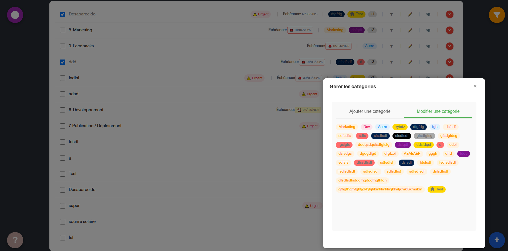

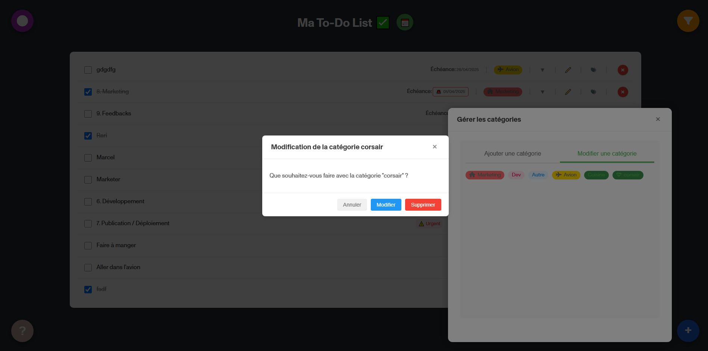

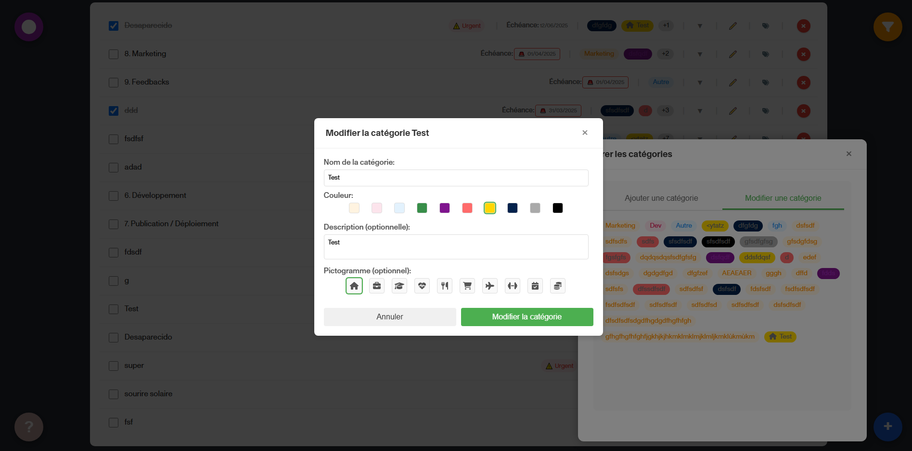

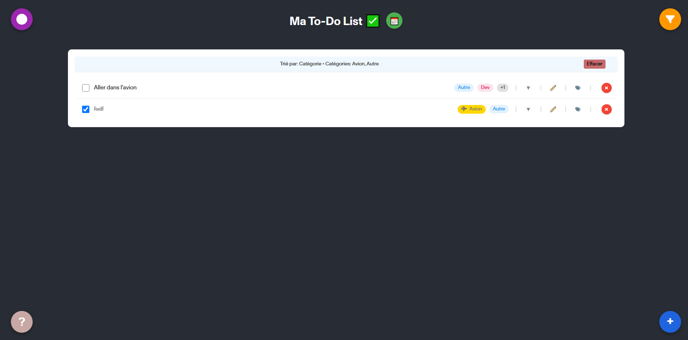

Tri par catégorie

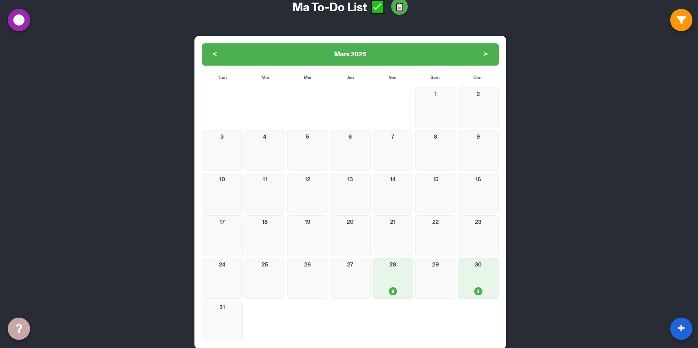

Affichage calendrier

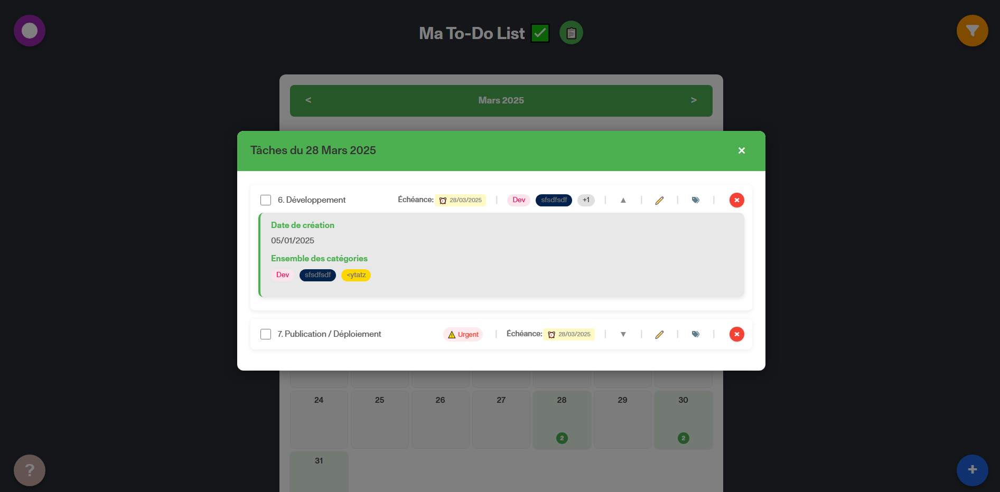

Affichage des tâches d'un jour depuis le calendrier

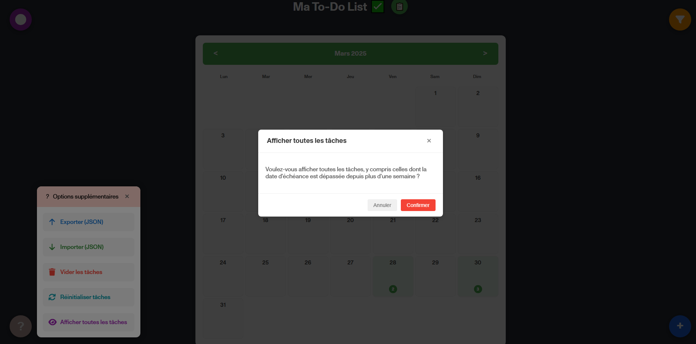

Modale de confirmation

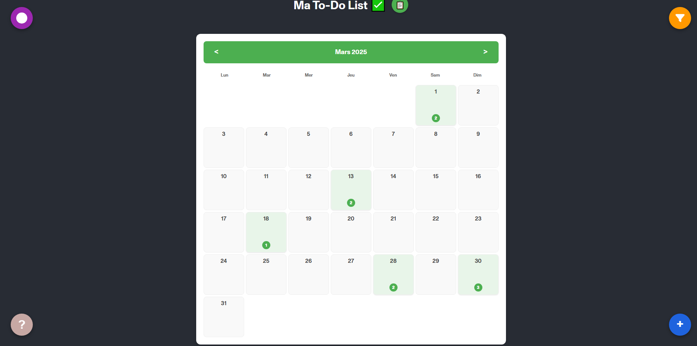

Démonstration de la modularité du code : affichage des tâches expirées
dans le calendrier car on a sélectionné "afficher toutes les tâches" dans le 
menu "?".

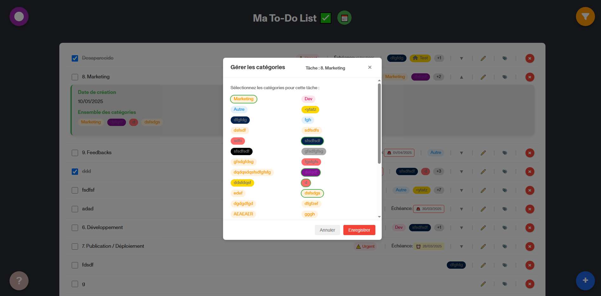

Ecran "gérer les catégories" depuis une tâche
